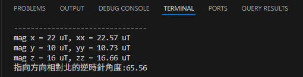
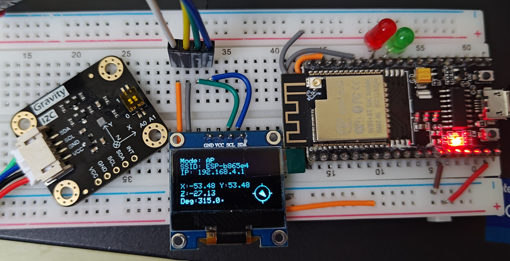

# 部落格文章 - ESP32 系列


---
### [[ESP32 系列] 初探 ESP32](https://lawrencetech.blogspot.com/2024/03/esp32-esp32.html) 
> * ESP32 基本介紹
> * Arduino IDE 開發工具
> * 第一個小程式
> * 物件導向的寫法，```Lab1_HelloWorld```


---
### Lab2_LCD，LCD 控制
> * 使用前須先安裝 `LiquidCrystal_I2C library`，可使用 packages 內的 LiquidCrystal_I2C-master.zip 壓縮檔，解壓縮進行安裝，安裝步驟可參考【[How to Use I2C LCD with ESP32 on Arduino IDE](https://randomnerdtutorials.com/esp32-esp8266-i2c-lcd-arduino-ide/)】、【[搭配LCD 1602 I2C顯示模組](https://shop.mirotek.com.tw/iot/esp32-start-9/)】這兩個網站的教學。
> * ESP32-S，LCD 需使用 I2C 通訊，5V 電壓
>     + SCL → GPIO 22 (右上 3)
>     + SDA → GPIO 21 (右上 6)


---
### Lab3_WiFi，連接 Wifi
> * 使用前需先到 WiFiController.h 設定底下的參數 
>     + `WIFI_SSID`：WIFI SSID
>     + `WIFI_PASSWORD`：WIFI 密碼
>     + `WIFI_GPIO_GREEN_LED`：WIFI 連線 "成功燈號" 的輸出腳位
>     + `WIFI_GPIO_RED_LED`：WIFI 連線 "失敗燈號" 的輸出腳位 


---
### Lab3_WiFiSwitch，Wifi AP 與 STA 模式切換
> * 使用前必須先安裝 ESPAsyncWebServer by lacamera 3.1.0 版，請注意這個套件版本較舊，因此僅能使用 ESP3 BOARD 2.0.X 版。
> * 搭配 Lab5_OLCD，OLCD 需使用 I2C 通訊，5V 電壓
>     + SCL → GPIO 22 (右上 3)
>     + SDA → GPIO 21 (右上 6)
> * 參考 [黑大提供的 Wifi 設定介面](https://blog.darkthread.net/blog/esp-wifi-conf-demo/)，提供 AP 模式與 STA(Station) 的切換模式調整的。


---
### Lab4_DHT11_DHT22，讀取溫濕度感測器
> * 使用前必須先安裝 DHT sensor library for ESPx v1.19 版。
> * 使用前需先到 TempHumController.h 設定底下的參數  
>     + `DHT_TYPE`：根據你的溫濕度感測器的類型調整此參數，預設使用 DHT11
>     + `DHT_GPIO`：溫溼度的輸入腳位


---
### Lab5_OLCD，OLCD 控制
> * 使用前必須先安裝 Adafruit SSD1306 v2.5.16 版。
> * ESP32，OLCD 需使用 I2C 通訊，5V 電壓
>     + SCL → GPIO 22 (右上 3)
>     + SDA → GPIO 21 (右上 6)


---
### Lab6_MQTT，結合 Wifi + MQTT 發送訊息
> * 使用前須先安裝 `PubSubClient library`，可使用 packages 內的 pubsubclient-master.zip 壓縮檔。
>   * https://github.com/knolleary/pubsubclient
> * 也可透過 PubSubClient 關鍵字搜尋，可看到 PubSubClient Nick O'Leary <nick.oleary@gmail.com> v2.8 版。
> * 使用前需先到 WiFiController.h 設定底下的參數 
>     + `WIFI_SSID`：WIFI SSID
>     + `WIFI_PASSWORD`：WIFI 密碼
>     + `WIFI_GPIO_GREEN_LED`：WIFI 連線 "成功燈號" 的輸出腳位
>     + `WIFI_GPIO_RED_LED`：WIFI 連線 "失敗燈號" 的輸出腳位 
> * 使用前需先到 MqttController.h 設定底下的參數 
>     + `MQTT_SERVER`：MQTT Server Host
>     + `MQTT_PORT`：MQTT Server Port
>     + `MQTT_ID`：MQTT 連線 ID
>     + `MQTT_DEFAULT_TOPIC`：MQTT 預設主題


---
### Lab7_TTP223，Touch 感測器
> * SCL → Input Pin 33


---
### Lab8_RSA，RSA 加解密範例
> * 使用前需先到 RSA.h 設定底下的參數 
>     + `RSA_P`：質數 p
>     + `RSA_Q`：質數 q
>     + `RSA_E`：加密指數 e，必須是與 (p−1)×(q−1) 互質的數字


---
### Lab9_Elgamal，Elgamal 加解密範例
> * 使用前需先到 Elgamal.h 設定底下的參數 
>     + `Elgamal_P` : 質數，請注意，這邊預設 2147483647，若加密的值超過此數字，需調整，否則求餘數後會造成錯誤。
>     + `Elgamal_G` : 公開選定的數(任意)，預設 1983


---
### Lab10_MultiThread，多執行緒執行範例
> * 一個執行緒負責抓取資料(每五秒抓一次)，另外一個執行緒負責發送資料(每秒發送一次)


---
### Lab11_KY031，敲擊感測器
> * 這顆 Sensor 不知道是不是買到中國仿品，它是 `常開型` 的，所以判斷方式是顛倒的。
> * 範例每感應到一次敲擊會亮一下綠燈，當累積 10 次後，會變成紅燈。
> * 使用 GPIO Pin 如下
>     + 紅色 LED → Output Pin 16
>     + 綠色 LED → Output Pin 17
>     + 敲擊感測器 → Input Pin 32


---
### Lab11_SW520D，角度改測器
> * 直立時高電位顯示綠燈、水平時低電未紅燈。
> * 使用 GPIO Pin 如下
>     + 紅色 LED → Output Pin 16
>     + 綠色 LED → Output Pin 17
>     + 角度感測器 → Input Pin 32


---
### Lab12_BMM150，三軸數位地磁感測器
> * 使用前必須先安裝 DFRobot_BMM1506 v1.0.0 版，[Github](https://github.com/DFRobot/DFRobot_BMM150)。
> * 使用方式可參考 [範例網站](http://wiki.dfrobot.com.cn/_SKU_SEN0529_Gravity_BMM150_%E4%B8%89%E8%BD%B4%E5%9C%B0%E7%A3%81%E4%BC%A0%E6%84%9F%E5%99%A8)。
> * BMM150 需使用 I2C 通訊，3.3V-5V 電壓
>     + SCL → GPIO 22 (右上 3)
>     + SDA → GPIO 21 (右上 6)
> * **Lab12_BMM150_PlatformIO** 為 PlatformIO 版本專案
>
> 

 
---
### Lab50_GeomagneticMonitor，地磁監測器（WiFi + BMM150 + MQTT 多執行緒整合）
> * 本實驗結合 Lab3_WifiSwitch 與 Lab12_BMM150，並使用多執行緒架構。
> * **主要功能：**
>     + WiFi AP/STA 模式自動切換，狀態顯示於 OLED 第一區塊
>     + BMM150 地磁數據持續讀取並顯示於 OLED 第二區塊
>     + 網路連線成功後，透過 MQTT 發送地磁數據（JSON 格式，不加密）
> * **多執行緒架構（FreeRTOS）：**
>     + Core 0：WiFi 連線管理、MQTT 連線與發送
>     + Core 1：BMM150 數據讀取、OLED 顯示更新
> * **使用前準備：**
>     + 安裝 ESPAsyncWebServer by lacamera 3.1.0 版（注意：僅支援 ESP32 BOARD 2.0.X 版）
>     + 安裝 Adafruit SSD1306 v2.5.16 版
>     + 安裝 PubSubClient v2.8 版
>     + 安裝 DFRobot_BMM150 Library
> * **硬體接線：**
>     + OLED：SCL → GPIO 22、SDA → GPIO 21（I2C 通訊，5V 電壓）
>     + BMM150：SCL → GPIO 22、SDA → GPIO 21（I2C 通訊，3.3V-5V 電壓）
> * **可調整參數（於 .ino 檔案中）：**
>     + `BMM150_READ_INTERVAL_MS`：BMM150 讀取間隔（預設 1000ms）
>     + `MQTT_SEND_INTERVAL_MS`：MQTT 發送間隔（預設 5000ms）
> * **可調整參數（於 MqttController.h 中）：**
>     + `MQTT_SERVER`：MQTT Server Host
>     + `MQTT_PORT`：MQTT Server Port
>     + `MQTT_ID`：MQTT 連線 ID
>     + `MQTT_DEFAULT_TOPIC`：MQTT 預設主題
> * **MQTT 發送格式（JSON）：**
>     ```json
>     {"x":12.34,"y":56.78,"z":90.12,"degree":123.45}
>     ```

### Lab50_GeomagneticMonitor_PlatformIO，地磁監測器（PlatformIO 版本）
> * 此為 Lab50_GeomagneticMonitor 的 PlatformIO 移植版本，功能完全相同。
> * **專案依賴套件（platformio.ini）**：
>     + `DFRobot_BMM150`：三軸地磁感測器驅動（使用 GitHub URL）
>     + `Adafruit SSD1306 @ ^2.5.16`：OLED 顯示驅動
>     + `PubSubClient @ ^2.8`：MQTT 通訊
>     + `ESPAsyncWebServer`：WiFi 設定網頁伺服器（使用 GitHub URL）
>     + `AsyncTCP`：ESPAsyncWebServer 依賴（使用 GitHub URL）
> * **硬體接線（與 Arduino IDE 版本相同）**：
>     + OLED：SCL → GPIO 22、SDA → GPIO 21（I2C，5V）
>     + BMM150：SCL → GPIO 22、SDA → GPIO 21（I2C，3.3V-5V）
> * **可調整參數（於 MqttController.h 中）**：
>     + `MQTT_SERVER`、`MQTT_PORT`、`MQTT_ID`、`MQTT_DEFAULT_TOPIC`
> 
> 


---
### Lab99_FinalProject，溫溼度發送到 MQTT
> * 本實驗使用 DHT11、Touch、OLCD、WIFI、LED 等 IO。
> * 將溫溼度數據使用 RSA 或 Elgamal 加密後，透過 MQTT 通訊發送到 MQTT Server。
> * 另外除發送外也會從 MQTT Server 接收訂閱並使用 RSA 或 Elgamal 解密後，將結果顯示在 OLCD 上。
> * 若超果指定時間，會關閉 OLCD 的畫面，必須透過觸摸 Touch Sensor 才會重新開啟。


---
### Lab99_FinalProject2，溫溼度發送到 MQTT(使用多核心處理)
> * 參考 Lab6_MQTT 說明，先完成底下兩個檔案的參數設定
>     + `WiFiController.h` 
>     + `MqttController.h` 
> *  CPU 核心 0 : 
>     + 連接 WIFI 並控制 Wifi 連接狀態的 LED 燈。
>     + 連接 MQTT。
>     + 讀取 MqttReceived 發送的 Elgamal (p, q, Y) 公鑰訊號。
>     + 發送 Elgamal 加密的訊號。
> *  CPU 核心 1 : 
>     + 讀取溫溼度訊號，並更新發送訊號註記。
>     + 將溫濕度訊號顯示在 OLED 上。


---
### Lab99_FinalProject3，震動事件偵測 MQTT(使用多核心處理)
> * 參考 Lab6_MQTT 說明，先完成底下兩個檔案的參數設定
>     + `WiFiController.h` 
>     + `MqttController.h` 
> *  CPU 核心 0 : 
>     + 連接 WIFI 並控制 Wifi 連接狀態的 LED 燈。
>     + 連接 MQTT。
>     + 讀取 MqttReceived 發送的 Elgamal (p, q, Y) 公鑰訊號。
>     + 發送 Elgamal 加密的訊號。
> *  CPU 核心 1 : 
>     + 讀取震動訊號，並更新發送訊號註記。
>     + 將震動 & 網路連線 & Elgamal 公鑰交換狀態，顯示在 OLED 上。


---
### MqttReceived，負責接收和產生 Lab99_FinalProject2 的 Elgamal Key 和解密
> * 使用 NET Core 實做接收器，必須先到 appsettings.json 設定底下的參數 
>     + `Elgamal.P` : 質數，請注意，這邊預設 2147483647，若加密的值超過此數字，需調整，否則求餘數後會造成錯誤。
>     + `Elgamal.G` : 公開選定的數(任意)，預設 1983
>     + `Elgamal.x` : 接收端自選秘鑰(KEY)，預設 9527
>     + `MQTT.Broker` : 使用 Demo MQTT，可不需調整。
>     + `MQTT.Port` : 使用 Demo MQTT，可不需調整。
>     + `MQTT.Topic` : 配合 Lab99_FinalProject2 內的設定一併調整。
>     + `SendPublicKeyInterval` : 公鑰發送週期(毫秒)。
>     + `LineNotifyToken` : LINE Notify 通知群組 Token。
>     + `ESP32ChipInfos` : ESP32 各晶片 ID 對應顯示名稱。
>       + `ChipId` : 請先使用 GetChipId() 範例程式取得。
>       + `UserName` : 顯示名稱。

> * 作業流程 :
>     1. 發送 Elgamal (p, q, Y) 到 MQTT Server。
>     2. 收到 Lab99_FinalProject2 發送的訊號進行解密。


## PlatformIO 建置與上傳（通用）
* 以下為常用 PlatformIO 指令，適用於任一 PlatformIO 專案： 
    ```bash
    # 建置 (build)
    platformio run 

    # 上傳 (upload)
    platformio run --target upload
    
    # 監看序列埠 (monitor)
    platformio device monitor --baud 115200
    ```
* 注意事項：
    + 若需指定上傳埠，請加上 `-p COMx`（例如 `platformio run --target upload -p COM3`）。
    + 若 library 下載失敗，可把第三方庫 clone 到本地並放到專案 `lib/` 目錄，或在 `platformio.ini` 使用 `lib_extra_dirs` 指向本機路徑。
* `platformio.ini` 常用欄位說明：
    + `platform`：指定平台（例如 `espressif32`）。
    + `board`：選擇開發板型號（例如 `esp32dev`），會影響編譯與燒錄設定。
    + `framework`：使用的開發框架（例如 `arduino` 或 `espidf`）。
    + `lib_deps`：第三方函式庫依賴，可使用 GitHub URL 或套件名稱（例如 `lib_deps = https://github.com/DFRobot/DFRobot_BMM150`）。
    + `upload_speed`：上傳（燒錄）速度（例如 `921600`）。
    + `monitor_speed`：序列監視器鮑率（例如 `115200`）。
    + `upload_port`：可選，強制指定上傳埠（例如 `COM3`）。
    + `lib_extra_dirs`：指定本機額外的 library 目錄，方便加入無法從網路下載的庫。
* 範例 `platformio.ini`（精簡）：
    ```ini
    [env:esp32dev]
    platform = espressif32
    board = esp32dev
    framework = arduino
    lib_deps = https://github.com/DFRobot/DFRobot_BMM150
    upload_speed = 921600
    monitor_speed = 115200
    ```


---
### License
The MIT license